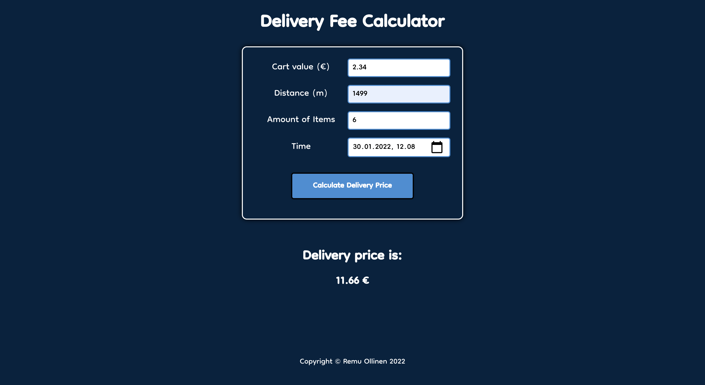

# Delivery Fee Calculator

- This application calculates the delivery price based on what values the user inputs (cart value excluded).
- The user can input cart value, delivery distance, number of items and time for delivery.

- Built with React and TypeScript

- Live version hosted on Netlify. See it [here](https://condescending-euler-68cf1f.netlify.app/).

## Usage

1. Get the application folder to your local computer in your preferred way (i.e. forking or cloning this project). You could have also downloaded it if the project folder was shared with you.

2. Open the folder in your chosen code editor and navigate to the folder via CLI

```shell
> cd FOLDER_PATH
```

3. Since the node_modules folder is ignored or missing from the project folder, you have to install node_modules

```shell
> npm install
```

4. To run the application in your browser, on `localhost:3000`, type the following command

```shell
> npm start
```

### You should see this in your browser (with empty fields)



## Tests

- To run tests, type the following command via CLI

```shell
> npm test
```

- If no tests are run, follow the instructions given in your CLI.
- You might need to press `Enter` to run the tests. If that doesn't yet show below view, press `a` to run all tests.

### Possible output of tests


## Resources

- This was a pre-assignment for a summer internship at Wolt.
- Here is the link to the instruction of the pre-assignment: [https://github.com/woltapp/engineering-summer-intern-2022](https://github.com/woltapp/engineering-summer-intern-2022)
